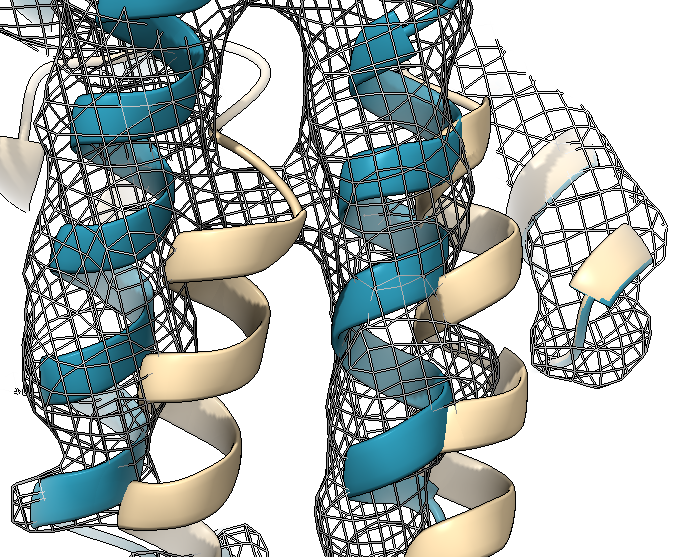

# CryoJAM: Automating Protein Homolog Fitting in Medium Resolution Cryo-EM Density Maps Using Deep Learning

CryoJAM automates the fitting of protein homologs into cryo-electron microscopy (cryo-EM) density maps, focusing on large multi-subunit protein complexes at medium resolutions (4-8 Å). Utilizing advanced 3D Convolutional Neural Network architectures, CryoJAM enhances the fitting process, addressing the computational and time challenges present in traditional methods.

## File structure:
`/cryojam`: src code and use cases for the entire workflow  
`/cryojam/utils`: Utility files for CryoJAM  
`/data`: Data required for testing  
`/ckpt`: Model weights saved at various checkpoints  
`/analysis`: Notebooks for analysis to compare varirous models and ablation studies  

## Installation:
```sh
git clone https://github.com/jtcarrion/CryoJAM.git
```

## Use case:
Below we can see two specifc helices from the eukaryotic replicative CMG helicase in S. cerevisiae (PDB: 3JC5 at ~800kDa) being optimally fit into the experintal density of a different CMG helicase (EMD-3318 at ~5A). The tan PDB structure is before CryoJAM and the blue PDB is the predicted structre from CryoJAM.  

